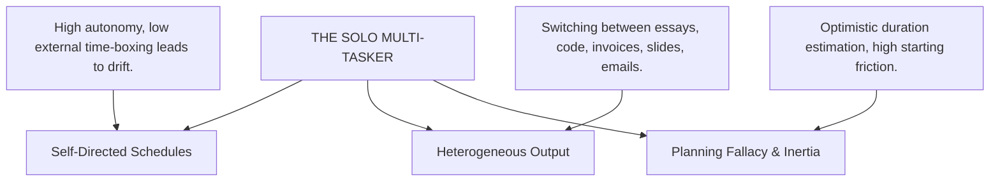
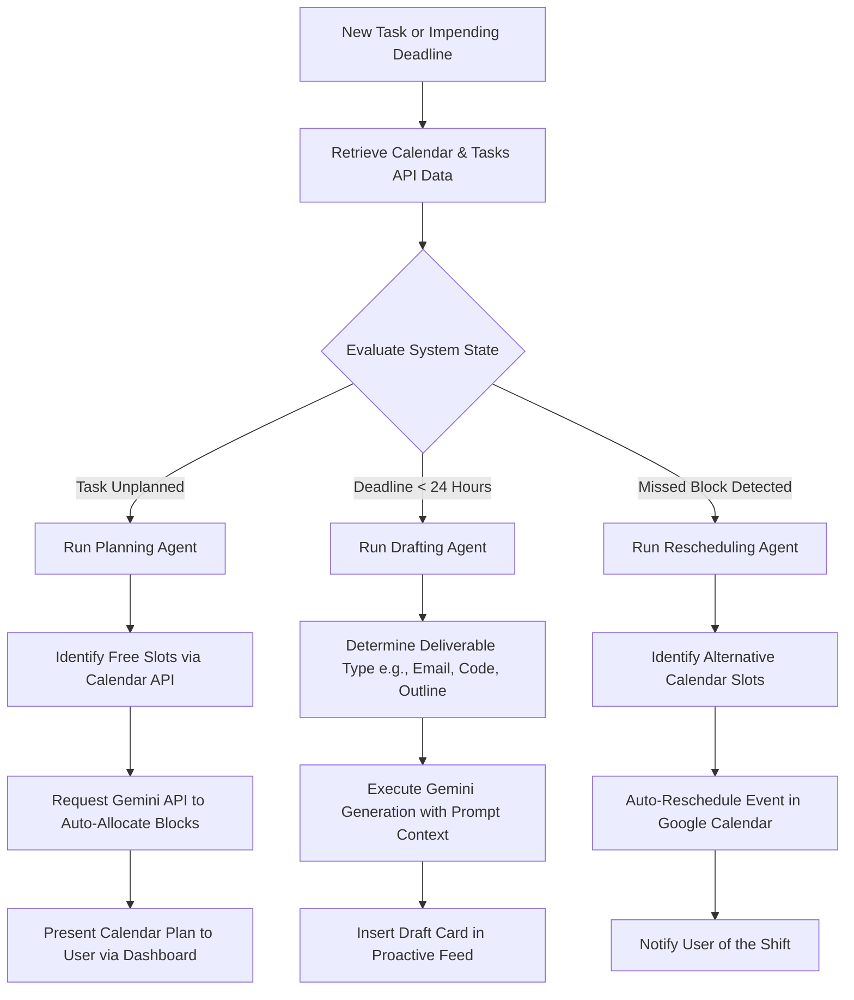

# Product Specification: The Last-Minute Life Saver (Proactive AI Productivity Companion)

**Phase 1: Problem Definition & Scope Specification**
- **Document Status**: Finalized
- **Date**: June 23, 2026
- **Author**: Product Planner Agent
- **Target Location**: `docs/phase_1_specification.md`

---

## 1. Executive Summary & Hackathon Context

### 1.1 Product Vision
Traditional calendar and task management tools are passive repositories of obligations—they announce deadlines but offer no assistance in meeting them. The **Last-Minute Life Saver** is a proactive, agentic AI productivity companion designed to bridge the gap between planning and execution. By analyzing a user's calendar, predicting actual effort requirements using the Gemini API, auto-scheduling dedicated focus blocks, and pre-emptively drafting work deliverables (such as outlines, reports, or emails), the system shifts the human user from a state of procrastination to active, friction-free momentum.

### 1.2 Timeline Constraints & Feasibility
The project must be designed, implemented, tested, and deployed within a strict **7-day hackathon timeline** (June 22 – June 29). To ensure a successful submission by **June 29, 2:00 PM**, we adopt a single-user system architecture with simulated elements where appropriate, leveraging local file-based persistence rather than a heavy distributed database.

### 1.3 Key Google Tech Integrations
- **Gemini API (via Google AI Studio SDK)**: Serves as the cognitive engine for task planning, scheduling recommendations, function calling, and proactive content drafting.
- **Google Calendar API**: Serves as the core scheduling backbone and primary source of truth for the user's availability.

---

## 2. Target User Persona: "The Solo Multi-Tasker"

To maximize product focus and keep the development scope tight, we unify students, freelancers, independent professionals, and solo entrepreneurs under a single primary persona: **The Solo Multi-Tasker**.



### 2.1 Persona Definition & Shared Productivity Patterns
The Solo Multi-Tasker is an individual who operates with high autonomy but suffers from fragmented attention and execution friction. They are defined by the following behavioral traits:
- **Self-Directed Schedules**: They have absolute control over their time. While this offers freedom, it lacks the structural time-boxing of external managers or strict team syncs. This leads to drift, distraction, and delayed starts.
- **High Volume of Heterogeneous Deliverables**: They are not specialists in a single task category; they switch constantly between writing reports, drafting emails, coding, planning study guides, or preparing slides. This context-switching creates cognitive fatigue.
- **Procrastination & Starting Friction**: The most challenging phase of any task for them is *getting started*. Facing a blank screen or an undefined task generates anxiety, leading them to delay the task until the deadline is dangerously close.
- **The Planning Fallacy**: They consistently underestimate the time required to complete tasks, assuming they can finish complex deliverables in unrealistic windows (e.g., "I'll write this 10-page paper in 2 hours").
- **Notification Desensitization**: Standard push notifications and calendar alerts ("Task due tomorrow") are routinely ignored, snoozed, or blocked. They have developed "notification blindness."

### 2.2 Core User Pain Points & AI Solutions
1. **The Inertia of the Blank Page**:
   - *Pain Point*: Sitting down to work but spending 30 minutes deciding where to start.
   - *AI Solution*: The agent pre-emptively generates outlines, research summaries, or starter templates before the user even sits down to work.
2. **Chronic Over-Scheduling**:
   - *Pain Point*: Piling up tasks on a calendar without checking actual hours available or accounting for energy depletion.
   - *AI Solution*: The agent analyzes calendar density and blocks out realistic, simulated time blocks for tasks based on historical difficulty.
3. **Passive Alert Fatigue**:
   - *Pain Point*: Alarm goes off, user clicks "snooze", and forgets about the task.
   - *AI Solution*: Alerts are context-aware, actionable, and come pre-packaged with the assets needed to start the task immediately.

---

## 3. Active Companion Capabilities (Proactive vs. Reactive)

To secure a high score in **Agentic Depth (20%)**, the application must distinguish clearly between user-initiated interactions (reactive) and autonomous, system-initiated actions (proactive).

### 3.1 Proactive vs. Reactive Capability Matrix

| Capability Type | Feature Name | Trigger Source | AI Role / Processing | Output / Result |
| :--- | :--- | :--- | :--- | :--- |
| **Reactive** | Natural Language Task Entry | User input (text/voice) | Parses unstructured text/audio using Gemini into structured JSON tasks. | Task added to database with calculated priority and estimated effort. |
| **Reactive** | Interactive Chat Assistant | User queries in Chat Drawer | Clarifies requirements, answers questions, or refines existing drafts on-demand. | Real-time text responses, search snippets, or modified templates. |
| **Reactive** | On-Demand Draft Request | User clicks "Draft Now" on a task | Generates immediate starter code, outlines, or emails. | Populates the task detail screen with a tailored workspace draft. |
| **Proactive** | Smart Planning & Auto-Scheduling | Background sync of new tasks/deadlines | Scans Google Calendar for free slots, simulates effort, and schedules focus blocks. | Drafts proposed Google Calendar events and sends approval cards to feed. |
| **Proactive** | Pre-emptive Deliverable Drafting | Approaching deadline (24 hours prior) | Initiates a background agent workflow to write outlines, drafts, or briefs. | Inserts a "One-Click Approve & Ship" draft card directly into the user's feed. |
| **Proactive** | Context-Aware Procrastination Nudge | High-priority task due + free calendar block | Compares current time, calendar state, and task importance to generate an intervention. | Actionable notification: "You have 2 hours free. I've prepared a draft of X. Let's write." |
| **Proactive** | Self-Healing Habit Rescheduling | Focus block passes without completion | Automatically detects a missed calendar block (user did not check off). | Proposes alternative slots and auto-shifts future blocks to accommodate. |

### 3.2 Agent Autonomous Decision Loop (Proactive Execution)



---

## 4. OAuth 2.0 Technical Scope & Google Calendar API Integration

Google Calendar serves as the scheduling backbone of the application. The system integrates directly with the Google Calendar API to read availability, write focus blocks, and track task execution.

### 4.1 OAuth 2.0 Authorization Flow

To protect the 7-day hackathon timeline, the application utilizes a simplified, secure **Single-User OAuth Flow**. The developer/judge registers their own Google Cloud Console credentials, allowing the application to authenticate a single user session to sync their calendar.

```
+-------------+      Redirect (Auth Code request)     +----------------------+
|             | ------------------------------------> |                      |
|             |   (access_type=offline, prompt=consent)|                      |
|             |                                       |                      |
|    User     |      Grant Auth Code & Redirect       |    Google OAuth      |
|   Browser   | <------------------------------------ |    Authorization     |
|             |                                       |        Server        |
|             |                                       |                      |
|             |   Post Auth Code (via backend callback) |                      |
+-------------+ ------------------------------------> +----------------------+
       ^                                                         |
       |                                                         | Exchange Code
       | Store Tokens                                            | for Access &
       v                                                         v Refresh Tokens
+-------------+                                       +----------------------+
| Application | <------------------------------------ |  Token Exchange      |
| Backend /   |        Access & Refresh Tokens        |  Endpoint            |
| Local Store |                                       |                      |
+-------------+                                       +----------------------+
```

### 4.2 Technical Integration Parameters
1. **Google Cloud Console Setup**:
   - Enable the **Google Calendar API** and **Google Tasks API**.
   - Configure OAuth Consent Screen: User Type = External, Publishing Status = Testing (limiting access to designated test accounts).
   - Scopes Requested:
     - `https://www.googleapis.com/auth/calendar` (Read and write calendars)
     - `https://www.googleapis.com/auth/calendar.events` (Manage calendar events)
     - `https://www.googleapis.com/auth/tasks` (Optional: Manage tasks)
     - `openid`, `email` (For identity matching)
2. **Backend Token Lifecycle Management**:
   - **Auth Code Exchange**: The backend receives the authorization code, exchanges it via `https://oauth2.googleapis.com/token`, and retrieves:
     - `access_token` (expires in 3600 seconds)
     - `refresh_token` (long-lived, offline access)
     - `expires_in` (expiration timestamp)
   - **Token Storage**: Given the single-user scope, tokens are stored securely in a local JSON configuration file inside the `.tmp/` folder (encrypted with a local key in production, or read directly from a safe server environment variable path).
   - **Auto-Refresh Lifecycle**:
     - Before making any API request to Google Calendar, the backend validates the `expires_in` timestamp.
     - If the token is within 5 minutes of expiration, the backend initiates a POST request to Google's token endpoint:
       ```
       POST https://oauth2.googleapis.com/token
       Content-Type: application/x-www-form-urlencoded
       
       client_id=YOUR_CLIENT_ID&
       client_secret=YOUR_CLIENT_SECRET&
       refresh_token=YOUR_REFRESH_TOKEN&
       grant_type=refresh_token
       ```
     - The database/config is updated with the new `access_token` and updated expiration timestamp.
     - If refresh token rotation fails (e.g., user revoked permissions), the server wipes the local credentials, redirects the user to the auth screen, and sets the dashboard to an "Unauthenticated" status.

---

## 5. Feasibility Boundaries & Project Scope

To ensure a functional deployment on Google Cloud Run by the June 29 deadline, we enforce strict scoping boundaries.

### 5.1 In-Scope vs. Out-of-Scope Definitions

> [!IMPORTANT]
> The boundaries below are rigid and designed to prevent scope creep during the 7-day development window.

#### In-Scope (Mandatory Core Deliverables)
1. **Single-User Architecture**:
   - The application supports a single active user session (the developer/judge), storing tasks, history, and preferences.
2. **Glassmorphism Web Dashboard**:
   - A modern responsive web dashboard featuring:
     - **Main Workspace Canvas**: Shows current tasks, deadline severity, and active calendar blocks.
     - **Proactive Feed Sidebar**: A feed displaying AI card actions (e.g., "Draft ready for approval," "Missed block rescheduled").
     - **Agent Interaction Drawer**: Chat drawer for manual commands, drafting queries, and planning requests.
3. **Google Calendar Integration**:
   - Real integration via REST API to pull user schedules and push focus blocks.
4. **Supabase (PostgreSQL) Persistence**:
   - Tasks, habits, scheduling states, and encrypted OAuth tokens are stored in a free-tier Supabase PostgreSQL database to ensure state persistence across ephemeral Cloud Run container recycles.
5. **Seeded Demo Experience**:
   - A "Seed Demo Data" action within the developer console of the UI that runs a backend script to instantly populate Supabase with a realistic, rich profile of tasks, deadlines, and habits for easy evaluation by judges.
6. **Gemini API Pipeline**:
   - Structured JSON outputs from Gemini for parsing tasks.
   - Dynamic prompt generation for planning, nudging, and deliverable drafting.
7. **Simulated Voice Assistance**:
   - Standard browser Web Speech API (Speech-to-Text and Text-to-Speech) for hands-free scheduling commands inside the web UI.

#### Out-of-Scope (Strictly Excluded)
1. **Multi-Tenant User Management & Public Sign-Ups**:
   - No Firebase Auth, Auth0, or Cognito. The application does not support user registration. It is an administrative/personal console for the authorized Google Account.
2. **Native iOS / Android Apps**:
   - The application will be a responsive Web Application (desktop-first cockpit) deployed to Cloud Run. No app store packaging.
3. **Complex Distributed Cloud Databases (Except Supabase)**:
   - No heavy AWS RDS, DynamoDB, or MongoDB Atlas configurations. A simple free-tier Supabase project is used as a managed database, avoiding any complex VPC networking setup.
4. **Third-Party Email/Slack Delivery**:
   - The agent *drafts* the email content inside the dashboard UI for the user to copy. It does *not* connect to SMTP/SendGrid or Slack APIs to transmit messages externally.
5. **Native Audio Streaming Servers**:
   - No real-time WebRTC audio server integrations. Voice commands are processed locally in the client browser.

---

## 6. Architecture & Tech Stack Overview

### 6.1 Technical Stack

```
   ┌────────────────────────────────────────────────────────┐
   │                       FRONTEND                         │
   │            React.js / Vite / Tailwind (TS)             │
   │      - Dashboard UI with Glassmorphism Cards          │
   │      - Chat Drawer (Agent Interaction Console)        │
   │      - Web Speech API (Speech Synthesis/Recognition)   │
   └───────────┬────────────────────────────────┬───────────┘
                │                                │
       API Calls│                                │API Calls
                ▼                                ▼
   ┌────────────────────────────────┐  ┌────────────────────┐
   │            BACKEND             │  │   EXTERNAL APIS    │
   │     Node.js / Express / TS     │  │    & SERVICES      │
   │   - OAuth 2.0 Client Flow      │  │ - Google Calendar  │
   │   - Task Planning Engine       │  │ - Supabase DB      │
   │   - DB Access & Data Seeding   │  │ - Gemini API       │
   └────────────────────────────────┘  └────────────────────┘
```

- **Frontend**: React (Vite) + Tailwind CSS + Lucide React icons.
  - Premium design using Outfit/Inter typography, harmonious gradients, and glassmorphism.
- **Backend**: Node.js + Express + TypeScript running in a single container.
- **AI Core**: Gemini 1.5 Pro / Flash via Google AI Studio API SDK.
- **Database**: Supabase (managed PostgreSQL cloud database).
- **Deployment**: Google Cloud Run (using AI Studio's direct deployment button or Docker container deployment).

---

## 7. Risk Analysis & Mitigation Strategies

| Risk | Impact | Likelihood | Mitigation Strategy |
| :--- | :--- | :--- | :--- |
| Google Calendar OAuth Consent screen approval delay | High | Medium | Configure the Google Cloud project in "Testing" mode. Add the judge's/developer's test email directly to the test users list. No verification is required for testing. |
| Container storage reset on Cloud Run restart | Low | High | Cloud Run container instances are stateless. Mitigation: Supabase is used as a persistent external database, so all task profiles, configurations, and tokens survive container recycles. |
| API Rate Limits (Gemini or Google Calendar) | Medium | Low | Implement backoff logic and display cached scheduling states in the frontend dashboard. Limit background sync polling intervals (e.g., check calendar once every 5 minutes rather than on every keypress). |
| Scope Creep on Proactive Execution | High | High | Keep the proactive actions constrained to three explicit types of cards: (1) Outline/Draft Card, (2) Calendar Proposal Card, and (3) Habit Reschedule Card. Do not build custom execution integrations for other tools. |

---

## 8. Summary of Resolved Product Decisions

1. **Backend Runtime & Language**: Node.js + Express + TypeScript (unified developer experience, rapid development).
2. **Database & Persistence (Option B + Seeding)**: Utilizes a free-tier Supabase instance to store task records, scheduling states, and encrypted OAuth tokens, preventing data loss during Cloud Run container recycles.
3. **Demo Experience**: Implements a "Seed Demo Data" action within the developer console of the UI. When clicked, this runs a backend script to instantly populate the Supabase database with a pre-configured, realistic profile of tasks, deadlines, and habits for a seamless evaluation by the judges.
